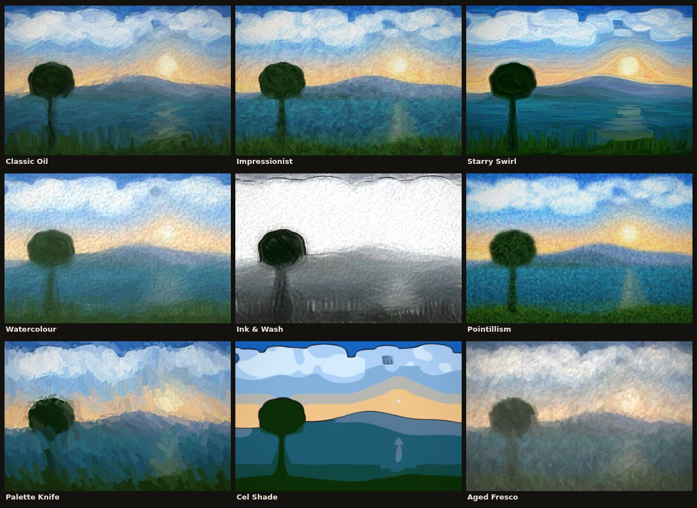
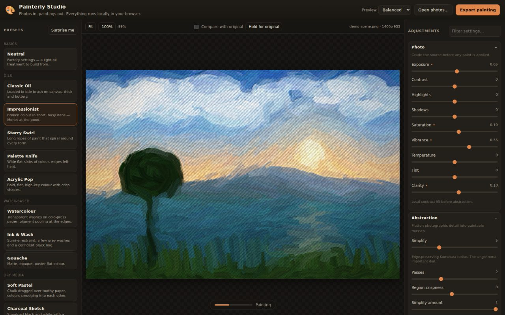

# Painterly Studio

Turn photographs into paintings, in the browser. Drop in a picture, pick a style,
then take over the fifty-odd controls behind it — brush size and stroke length,
how hard the paint follows the contours of the subject, canvas weave, impasto
relief, pigment edges, palette size.

No build step, no dependencies, no upload. Everything runs on your machine.



## Run it

```bash
npm start          # → http://127.0.0.1:5173
```

That is a ~90-line zero-dependency static server; anything else that serves the
folder over HTTP works just as well (`npx serve`, `python3 -m http.server`).
It has to be HTTP rather than `file://` because the app is plain ES modules.

Then drop a photo on the canvas, paste one from the clipboard, or click
**Load a demo image** to try it without a file.



## How it works

The photo passes through six stages. Each one is cached independently, so
nudging a *Finish* slider re-grades in a few milliseconds instead of repainting
sixty thousand brush strokes.

| Stage | What it does |
| --- | --- |
| **Grade** | Exposure, contrast, highlight/shadow rolloff, saturation, vibrance, white balance, local-contrast clarity. Runs first because everything downstream keys off tone and colour. |
| **Abstract** | A generalised **Kuwahara filter** flattens the picture into paintable masses while keeping edges crisp — the single most important dial in the app. Optional posterisation and a *k*-means limited palette stand in for painting from a handful of tubes. |
| **Flow** | A smoothed **structure tensor** gives a per-pixel direction that runs *along* edges rather than across them, plus an anisotropy measure that says how strongly oriented each neighbourhood is. |
| **Paint** | Coarse-to-fine layers of curved brush strokes follow that flow field. Each layer paints only where the canvas still differs from the reference, so flat sky stays broad and gestural while faces and edges collect progressively smaller strokes. |
| **Line & edge** | Contour drawing from the *abstracted* image (not the painted one — brush texture would come out as scribble), plus watercolour-style pigment darkening where a wash meets a boundary. |
| **Surface & varnish** | Procedural canvas weave / paper tooth, relief lighting that treats paint lightness as height so thick pale strokes catch the light, then glow, vignette, grain and framing. |

Stroke, smoothing and outline sizes are all authored against a 1200px reference
edge and scaled at render time, so the preview and the full-size export look
like the same painting rather than the same settings.

## Presets

| | |
| --- | --- |
| **Oils** | Classic Oil · Impressionist · Starry Swirl · Palette Knife · Acrylic Pop |
| **Water-based** | Watercolour · Ink & Wash · Gouache |
| **Dry media** | Soft Pastel · Charcoal Sketch · Pointillism · Dry Brush |
| **Graphic** | Cel Shade · Fauvist · Aged Fresco |

Every preset is just a sparse patch over the defaults, so they keep working when
new parameters are added. Save your own with **Save current…** — they persist in
the browser and can be exported to JSON to share.

## Working with it

- **Compare** — tick *Compare with original* and drag the split, or press and
  hold *Hold for original*.
- **Zoom** — scroll to zoom, drag to pan, double-click to fit. `f` fits, `c`
  toggles compare, `r` riffs on a random preset.
- **Double-click any slider** to snap it back to its default.
- **Filter settings…** searches all fifty-odd controls by name.
- **Several photos at once** — drop a batch, switch between them in the
  filmstrip, and tick *Export every loaded photo* to render them all with the
  current look.
- **Seed** — the brushwork is randomised but reproducible. Reroll for a
  different hand on the same settings.

### Getting a good result

1. Start from the preset closest to what you want; they are tuned to work
   together, and a lone slider rarely rescues a bad starting point.
2. **Simplify** first. Too low and the result is a slightly smudged photo; too
   high and the subject dissolves. It is the dial that decides whether the
   picture reads as a painting at all.
3. Then **Brush size**. Big brushes with fewer layers read as bold and gestural;
   small brushes with more layers stay faithful to the photo.
4. **Underpainting** below 1 lets bare paper show between strokes — essential
   for watercolour and pointillism, wrong for oils.
5. Portraits generally want lower Simplify, more layers and a higher refine
   threshold; landscapes take much more abstraction than you would expect.

## Performance

Everything runs on the main thread in plain JavaScript, chunked so the interface
stays responsive, with in-flight renders cancelled when you move another slider.
Rough figures for a 1400×930 photo on a laptop:

| Preview quality | Time |
| --- | --- |
| Fast (640px) | ~0.8 s |
| Balanced (1000px) | ~1.5 s |
| High (1500px) | ~3 s |
| Full-size export (2800×1870) | ~12 s |

Stroke count is deliberately resolution-independent — that is what keeps the
preview honest — so a smaller preview speeds up the filters, not the brushwork.

## Layout

```
index.html            markup and control shell
server.js             zero-dependency static server
src/
  main.js             app controller: files, rendering, export, persistence
  params.js           schema for every adjustable value (the single source of truth)
  presets.js          the preset library
  sample.js           procedural demo image
  pipeline/
    index.js          stage orchestration and caching
    adjust.js         photographic grade
    filters.js        box/Gaussian blur, Sobel, structure tensor, Kuwahara
    palette.js        hue shift, posterise, k-means palette
    strokes.js        the stroke-based painterly renderer
    ink.js            outlines and pigment edges
    surface.js        canvas/paper texture and impasto relief
    finish.js         glow, vignette, grain, final grade
  ui/
    controls.js       builds the panel from the schema
    viewer.js         pan/zoom canvas with the before/after split
scripts/smoke-test.mjs headless render check
```

The control panel, presets, save/load and validation are all generated from
`src/params.js`, so adding a knob there is the only step needed to expose it
everywhere.

## Tests

```bash
npm run smoke          # seven representative presets
npm run smoke -- all   # every preset in the library
```

Boots the server, drives the app in headless Chromium, and checks that each
preset produces a non-flat image that is not pixel-identical to another, then
exercises the full-resolution export path. Screenshots land in `out/`.
Requires Playwright (`npm i -D playwright`, or a global install).

## Browser support

Any current Chrome, Edge, Firefox or Safari. Needs `ResizeObserver`,
`<dialog>` and ES modules; `createImageBitmap` is used when available and falls
back to an `` decode.

## Licence

MIT — see [LICENSE](LICENSE).
